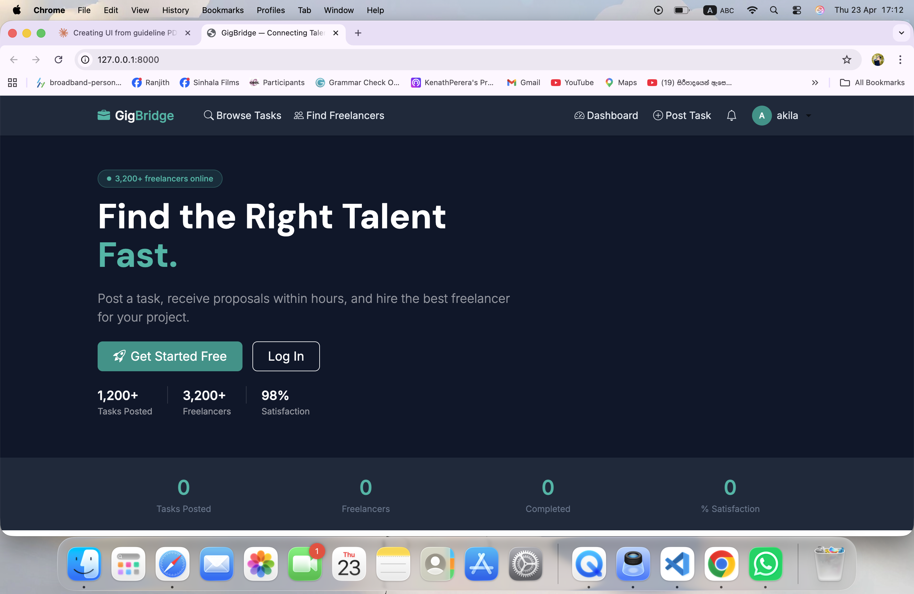
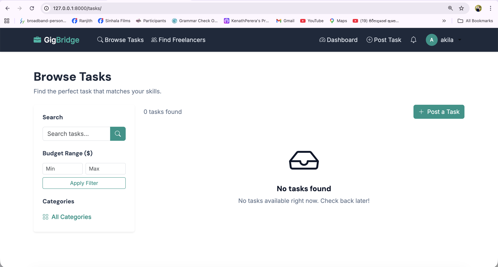
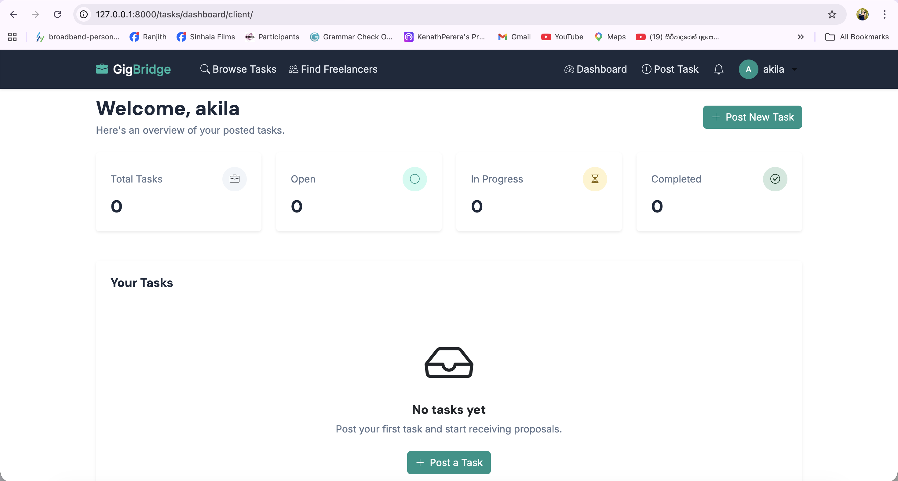
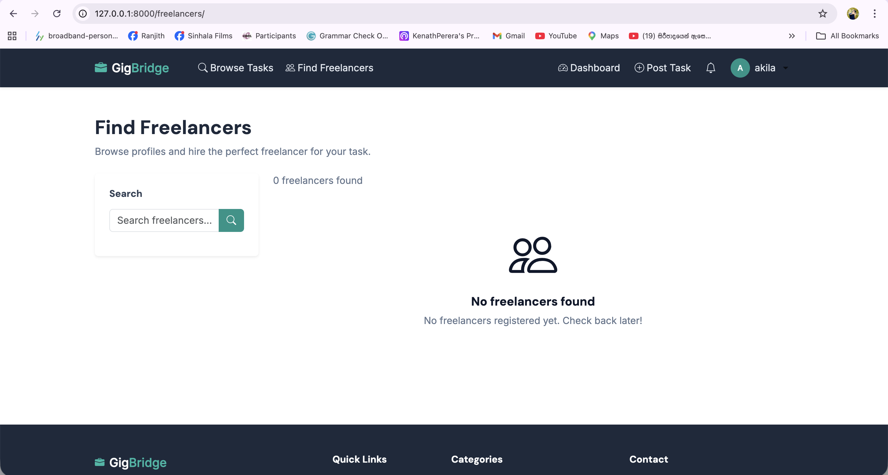
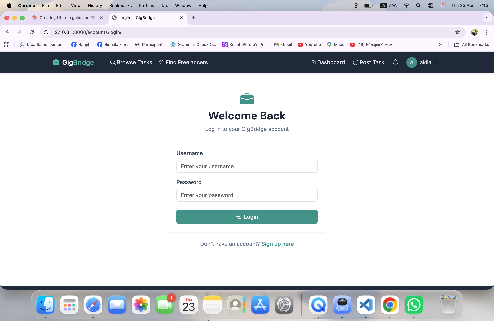

# GigBridge 🎳
**Connecting Talent with Opportunity 🤍**

## 📖 About GigBridge

GigBridge is a full-stack freelance marketplace web application that connects clients who need work done with skilled freelancers ready to deliver. Built as a university team project using Django and Bootstrap, GigBridge replicates the core functionality of real-world platforms like Fiverr and Upwork.

The platform supports two types of users — **clients** who post tasks and hire freelancers, and **freelancers** who browse opportunities and submit proposals. The entire workflow from task posting to project completion is handled within the platform, including proposal management, task awarding, and a star-based review system.

### 🎯 What Problem Does It Solve?

Finding reliable freelancers or quality work opportunities is often time-consuming and fragmented. GigBridge simplifies this by bringing everything into one place — task discovery, proposals, hiring decisions, and reviews — making the process faster and more transparent for both sides.

### 🔄 How It Works

1. **Client** registers and posts a task with a title, description, budget range, deadline, and required skills
2. **Freelancers** browse available tasks and submit proposals with their cover letter, price, and estimated delivery time
3. **Client** reviews all proposals and awards the task to the best candidate
4. **Freelancer** completes the work and the client marks it as done
5. Both parties can leave reviews, building reputation over time

---

## 📸 Screenshots

### Landing Page


### Browse Tasks


### Client Dashboard


### Find Freelancers


### Login & Register


---

## ✨ Features

### For Clients
- Register as a client and post detailed tasks with budgets, deadlines and required skills
- Browse freelancer profiles filtered by skill and availability
- Receive and review proposals with cover letters and pricing
- Award tasks to the best candidate in one click
- Mark tasks complete and leave star ratings and reviews

### For Freelancers
- Register and build a profile with skills, bio, and hourly rate
- Browse and search open tasks by category and budget
- Submit proposals with cover letters and estimated delivery time
- Track proposal status from a personal dashboard
- Build a review history to attract more clients

### Platform
- Role-based access control — clients and freelancers see different dashboards
- In-app notification bell for proposals, awards, and reviews
- Public browse pages for tasks and freelancers — no login required
- Fully responsive at 375px (mobile), 768px (tablet), and 1280px (desktop)
- Custom branded 404 and 500 error pages

---

## 🛠 Tech Stack

| Layer | Technology |
|---|---|
| Backend | Django 6 |
| Frontend | Bootstrap 5 (CDN) + Custom CSS |
| Database | SQLite (development) |
| Authentication | Django built-in session auth |
| Icons | Bootstrap Icons 1.11 |
| Fonts | DM Sans (headings) · Inter (body) |

---

## 🚀 Setup Instructions

### Prerequisites
- Python 3.12+
- Git

### 1. Clone the repository
```bash
git clone https://github.com/thevinduperera/gigbridge.git
cd gigbridge
```

### 2. Create and activate virtual environment
```bash
python -m venv venv

# Mac / Linux
source venv/bin/activate

# Windows
venv\Scripts\activate
```

### 3. Install dependencies
```bash
pip install -r requirements.txt
```

### 4. Apply migrations
```bash
python manage.py migrate
```

### 5. Create a superuser
```bash
python manage.py createsuperuser
```

### 6. Run the development server
```bash
python manage.py runserver
```

Open your browser at **http://127.0.0.1:8000**

---
## ⚠️ Important — Admin Setup Before Using the Platform

Before users can fully use GigBridge, a site administrator must add initial data through the Django admin panel. Two fields in the **Post a New Task** form will appear empty without this setup.

---

**To add categories:**

1. Go to **http://127.0.0.1:8000/admin**
2. Log in with your superuser credentials
3. Click **Categories** under the Tasks section
4. Click **Add Category** and create your categories

**Suggested default categories to add:**
- Web Development
- Graphic Design
- Writing & Content
- Digital Marketing
- Mobile Apps
- Data & Analytics
- Video & Animation
- Accounting & Finance

Once categories are added, they will automatically appear in the Post a Task form and the Browse by Category section on the landing page.

---

### 2. Add Skills

The **Skills Required** field in the Post a Task form will also be empty until skills are created.

**Steps:**
1. Go to **http://127.0.0.1:8000/admin**
2. Log in with your superuser credentials
3. Click **Skills** under the Tasks section
4. Click **Add Skill** and create your skills

 **Suggested default skills to add:**
- Python
- Django
- Javascript
- React 
- HTML & CSS
- Figma
- UI/UX Design
- Graphic Design
- Copywriting
- Data Analysis
- Video Editing
- PHP
- Social Media Marketing
- Android Development

---

## 🗂 Project Structure
```bash
gigbridge/
├── gigbridge/         
├── accounts/            
├── tasks/               
├── proposals/         
├── core/                
├── static/
│   ├── css/main.css     
│   └── js/main.js      
├── templates/
│   ├── base.html      
│   ├── navbar.html      
│   ├── footer.html     
│   ├── 404.html        
│   ├── 500.html        
│   ├── core/            
│   ├── accounts/        
│   ├── tasks/           
│   └── proposals/       
├── images/               
├── requirements.txt
└── README.md
```
---

## 👥 Team

| Member | App | Responsibilities |
|---|---|---|
| Member 1 - Dimeth | `accounts` | Custom user model, authentication, role-based profiles |
| Member 2 - Thevindu | `tasks` | Task CRUD, categories, client & freelancer dashboards |
| Member 3 - Linal | `proposals` | Proposal submission, award/reject flow, review system |
| Member 4 - Akila | `core` | Landing page, public browse pages, notifications, global UI/CSS |

---

## 🎨 Design System

All colours are defined as CSS variables in `static/css/main.css`. Never use raw hex values in templates — always use the variables.

| Variable | Hex | Usage |
|---|---|---|
| `--slate-900` | `#0f172a` | Navbar, hero background, headings |
| `--slate-800` | `#1e293b` | Footer, stats strip |
| `--slate-700` | `#334155` | Dark body text |
| `--slate-500` | `#64748b` | Muted text, placeholders |
| `--slate-200` | `#e2e8f0` | Borders, dividers |
| `--slate-100` | `#f1f5f9` | Page backgrounds, badges |
| `--teal-600` | `#0d9488` | Primary buttons, accents, links |
| `--teal-500` | `#14b8a6` | Hover states, highlights |
| `--teal-100` | `#ccfbf1` | Light teal fills, badges |

**Fonts:** DM Sans (headings, 700/500 weight) · Inter (body, 400/500 weight)

---

## 📋 Git Commit Conventions
- feat: add proposal submission form
- fix: correct task status update logic
- style: apply teal accent to dashboard cards
- refactor: extract notification helper to utils.py
- docs: update README with setup instructions
- chore: add Pillow to requirements.txt

---

## 🔗 Key URLs

| URL | Page |
|---|---|
| `/` | Landing page |
| `/accounts/register/` | Register |
| `/accounts/login/` | Login |
| `/tasks/` | Browse tasks |
| `/freelancers/` | Find freelancers |
| `/notifications/` | Notifications |
| `/tasks/dashboard/client/` | Client dashboard |
| `/tasks/dashboard/freelancer/` | Freelancer dashboard |
| `/admin/` | Django admin |

---

*Built with ❤️ by the GigBridge Team*
